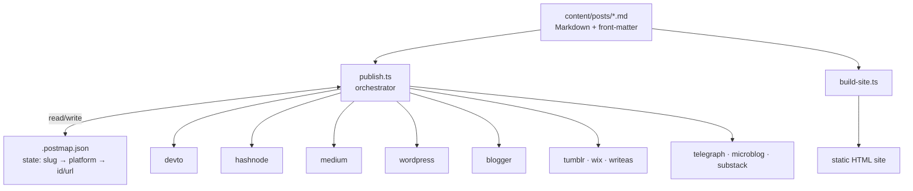
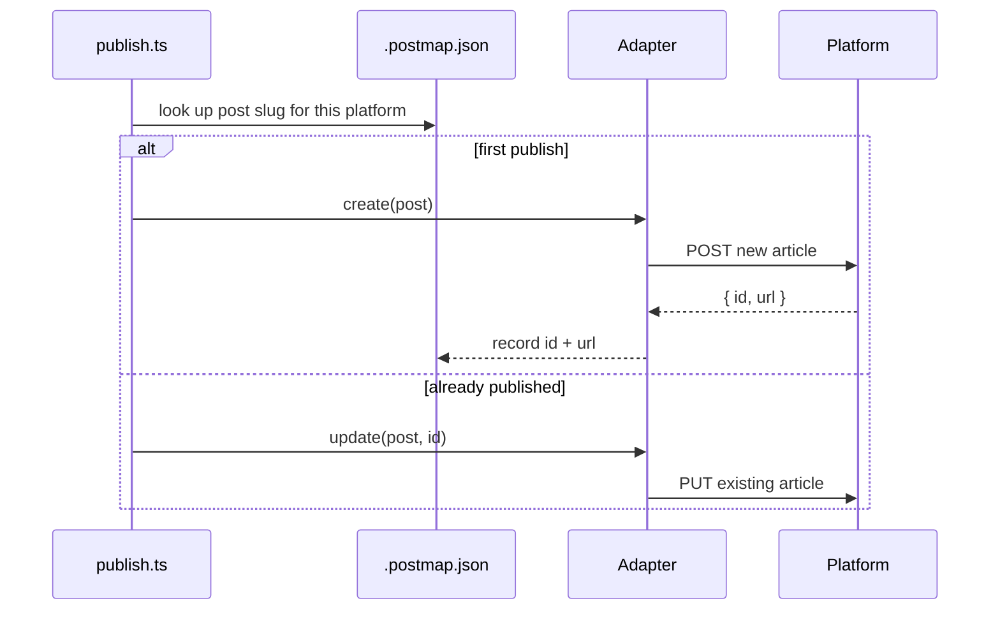

# ContentSync — Multi-Platform Content Syndication

> Write Markdown once, publish everywhere — a TypeScript CLI that syndicates one folder of Markdown posts to 11 blogging platforms and builds a static site from the same source.

[](LICENSE)
[](https://github.com/chirag127/ContentSync-MultiPlatform-Content-Syndication-Web-App/stargazers)
[](https://github.com/chirag127/ContentSync-MultiPlatform-Content-Syndication-Web-App/commits/main)
[](package.json)
[](https://contentsync-multiplatform-content-syndication-web-app.oriz.in)

## What it is / why it exists

Cross-posting the same article to Dev.to, Hashnode, Medium, WordPress and half a dozen other platforms by hand is slow and error-prone, and re-posting an edit creates duplicates. ContentSync solves that: keep your posts as Markdown files with YAML front-matter, run one command, and each post is published (or updated) on every platform you've configured. It tracks per-post, per-platform state so re-runs update the existing post instead of creating a copy — and it builds a static HTML site from the very same Markdown.

## Links

- **Live site:** https://contentsync-multiplatform-content-syndication-web-app.oriz.in
- **Landing page (GitHub Pages):** https://contentsync-multiplatform-content-syndication-web-app.oriz.in
- **Repo:** https://github.com/chirag127/ContentSync-MultiPlatform-Content-Syndication-Web-App

⭐ **If this is useful, please star the repo — it helps others find it.**

## How it works





## Features

- **One source of truth** — `content/posts/*.md` with YAML front-matter (title, slug, tags, …).
- **Pluggable adapters** — one file per platform in `src/adapters/`; add a platform by dropping in an adapter and registering it.
- **Idempotent** — `.postmap.json` maps `slug → platform → { id, url, lastUpdated }`, so re-runs update instead of duplicate.
- **Static-site generator** — `build-site.ts` renders the same Markdown into an HTML site.
- **Safe local testing** — `--dry-run` (no API calls) and `--mock` (against a bundled mock server).
- **Credential-aware** — platforms without configured tokens are skipped automatically.
- **Concurrency control** — `--concurrency <n>` (default 2).

## Supported platforms

Dev.to · Hashnode · Medium · WordPress · Blogger · Tumblr · Wix · Write.as · Telegraph · Micro.blog · Substack

## Tech stack

| Concern | Technology |
| --- | --- |
| Language | TypeScript 5 (Node 18+, `ts-node`) |
| CLI | `commander`, `chalk` |
| Markdown | `marked`, `gray-matter` |
| HTTP | `axios`, `oauth-1.0a` (Tumblr) |
| Files / config | `fs-extra`, `glob`, `js-yaml`, `dotenv` |
| Logging | `winston` |
| Lint | ESLint |

## Repository structure

```
content/posts/       Markdown source posts (front-matter + body)
src/
├── publish.ts        CLI entrypoint — publish orchestration
├── build-site.ts     static-site generator
├── generate-content.ts  content-generation helper
├── mock-server.ts    local mock API for --mock / npm test
├── adapters/         one file per platform (devto, hashnode, medium, wordpress,
│                     blogger, tumblr, wix, writeas, telegraph, microblog, substack)
│   ├── index.ts      adapter registry
│   └── types.ts      shared adapter interface
└── utils/            markdown.ts · state.ts · logger.ts
scripts/              content generation helpers
docs/                 CNAME + landing page (served at the oriz.in site)
.postmap.json         per-post, per-platform publish state
```

## Quick start

**Prerequisites:** Node 18+.

```bash
git clone https://github.com/chirag127/ContentSync-MultiPlatform-Content-Syndication-Web-App.git
cd ContentSync-MultiPlatform-Content-Syndication-Web-App
npm install
cp .env.example .env    # fill in only the platform tokens you use
```

Only the tokens for the platforms you actually target are required — adapters missing credentials are skipped.

## Usage

```bash
# Publish all posts to every configured platform
npm run publish

# Simulate without hitting any API
npm run publish -- --dry-run

# Run against the bundled mock server
npm test

# Generate the static site
npm run build-site

# Type-check / compile to dist/
npm run build
```

Options: `--dry-run`, `--mock`, `--concurrency <n>` (default 2).

## Content format

Each file in `content/posts/` is Markdown with front-matter:

```markdown
---
title: My Post Title
slug: my-post-title
tags: [tech, india]
---

Post body in Markdown.
```

## Configuration

Copy `.env.example` to `.env` and set the tokens for the platforms you use (names only — never commit real values):

| Variable | Purpose |
| --- | --- |
| `DEVTO_API_KEY` | Dev.to API key |
| `HASHNODE_TOKEN` | Hashnode personal access token |
| `MEDIUM_INTEGRATION_TOKEN` | Medium integration token |
| `WP_ACCESS_TOKEN`, `WP_SITE` | WordPress access token + site |
| `BLOGGER_CLIENT_ID`, `BLOGGER_CLIENT_SECRET`, `BLOGGER_REFRESH_TOKEN`, `BLOGGER_BLOG_ID` | Blogger OAuth + target blog |
| `TUMBLR_CONSUMER_KEY`, `TUMBLR_CONSUMER_SECRET`, `TUMBLR_TOKEN`, `TUMBLR_TOKEN_SECRET`, `TUMBLR_BLOG_IDENTIFIER` | Tumblr OAuth 1.0a credentials + blog |
| `WIX_API_TOKEN`, `WIX_SITE_ID` | Wix API token + site |
| `WRITEAS_API_TOKEN` | Write.as API token |
| `TELEGRAPH_ACCESS_TOKEN` | Telegraph access token |
| `MICROBLOG_TOKEN` | Micro.blog token |
| `SUBSTACK_API_TOKEN` | Substack API token |
| `MOCK_SERVER_URL` | Mock server base URL for `--mock` |
| `PUBLISH_CONCURRENCY` | Default publish concurrency |
| `LOG_LEVEL` | Log verbosity (`info`, `debug`, …) |

## Part of the oriz family

Part of the [oriz](https://blog.oriz.in) family — a fleet of ~80 small, focused apps and sites.

## Hosting cost

The landing site runs on Cloudflare's free tier — **$0**. The publisher itself is a CLI you run locally or in CI.

## Contributing

See [.github/CONTRIBUTING.md](.github/CONTRIBUTING.md). Adding a platform is a matter of dropping a new adapter in `src/adapters/` and registering it in `src/adapters/index.ts`. Conventional-commit messages, please.

## License

[MIT](LICENSE)

## Author

Chirag Singhal — [chirag@oriz.in](mailto:chirag@oriz.in)

## Status

Stable and in use. Conventional commits are the changelog.
